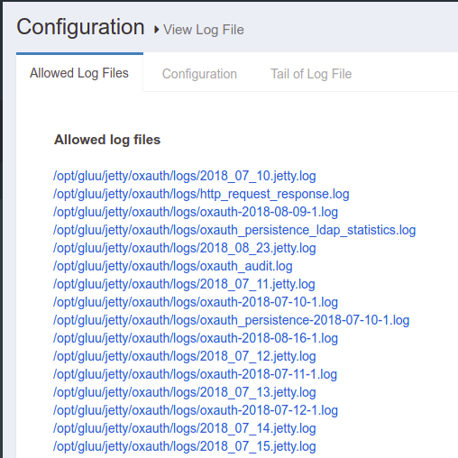
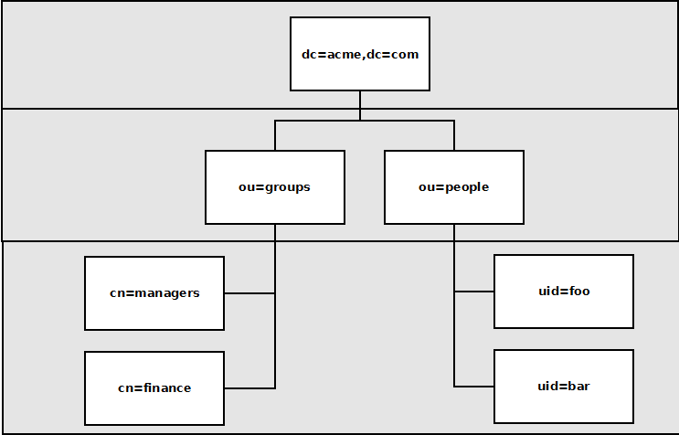

# Gluu Essential Training

## Welcome!

Thank you for participating in our Gluu Essential Training course. The purpose of this course is to demonstrate the most commonly used features of the Gluu Server with concrete examples and hands-on participation.

The Gluu Server is a Chroot-based container distribution of **free open source software (FOSS)** for identity and access management (IAM). The server can be leveraged for user authentication, identity information, and policy management. The software inside is integrated together to provide a wide variety of IAM solutions, such as single sign-on (SSO), mobile authentication, API access management, two-factor authentication (2FA), and more.

Possibly the most important part of the Gluu Server is that it is _free_ open source software. The code is available on GitHub,  Docker and Kubernetes documentation and deployment strategies are available, binary packages are published for Linux, and Gluu provides both free and VIP support options for the community. 

Gluu Essential Training will consist of a series of small lessons, each ending with a short knowledge check. At the end of the course, you’ll be ready to leverage our server in your own production environment for strong authentication and policy management. However, if you'd like to go a step further, you'll have the opportunity to schedule a virtual meeting with one of our trainers to go over the server you've created. We'll go over your server together, and if it's properly set up and working, we'll give you a verifiable badge that you can use on your resume and/or social media, proving that you're Gluu Essentials certified!

### The Identity Ecosystem

### Gluu Server Origins

### What's Inside? (Gluu Server component overview)

**oxAuth**: The core of the Gluu Server, oxAuth serves as the OAuth 2.0 Authorization Server, the OpenID Connect Provider, and the UMA Authorization Server.

**oxTrust**: This is the user interface for the Server. With few exceptions, everything you need to configure and operate your implementation is easily accessible here. 

**Shibboleth IDP**: To support outbound SAML single sign-on (SSO), Shibboleth is included as a SAML identity provider.

**Passport**: Passport is a versatile web application that the Gluu Server uses to support social login, inbound SAML, and inbound OpenID Connect SSO.

**OpenDJ**: This LDAP directory server is where all Gluu user data, session data, and more are stored.

**Apache2 Web Server**: The Apache Web Server brings HTTP services to the Gluu Server.

**JCE 1.8**: The Java Cryptography Extension provides encryption and key generation capabilities to the Gluu Server.

**oxAuth RP**: This is an app that provides sample requests and responses for OpenID Connect operations.

### Deployment Topologies

## Getting Started

### Installation

### File System Overview

### Start, stop and status

### Logs

When the Gluu Server experiences hiccups, outages, or other issues, the best place to lok for answers is the logs. The Gluu Server administrator can investigate the logs in oxTrust or directly with SSH to the `gluu-server-x.x.x` container. In oxTrust, the **View Log File** feature can be found by navigating to Configuration > View Log File. It'll look like this:



### Backup

## JSON Configuration

## LDAP

LDAP, or Lightweight Directory Access Protocol, is a database protocol that uses a tree format to facilitate fast and efficient lookups. With the hierarchical tree format, searches follow a path through the database that ignores any data that is not relevant to your search. One of the key benefits of LDAP over other database solutions is that LDAP is relatively vendor-agnostic. LDAP has a text-based format called “LDIF”, or LDAP Data Interchange Format, that allows for data to always be exported from one LDAP server to another. 

### LDAP structure

An individual unit of information in LDAP is called an “entry.” An LDAP directory is composed of many entries, connected together to form a tree. These entries are located using an address system using Distinguished Names (DNs), which are made up of Relative Distinguished Names (RDNs). The DN is the full address of an entry in the tree, while the RDN is a partial path relative to another entry. For example, the following DN:

`uid=foo,ou=people,o=acme`

is composed of three RDNs, each separated by a comma (but not a space).

Every DN must be unique in the tree, as it is the full address of where to find a particular entry. Attempting to add a duplicate DN will result in an error.

The tree itself is known as the namespace or Directory Information Tree (DIT), and is defined by how we name each entry in the tree. The following chart is the namespace for a hypothetical company, Acme, and consists of three levels.



The prefix of each RDN on this chart defines its location in the hierarchy. Spelled out, they are domain component (dc), organizational unit (ou), common name (cn), and user identification (uid). The first level, at the top of this chart, is called the root node. In this case, it consists of one entry that is made up of two components, dc=acme,dc=com. The second level consists of two entries, ou=people and ou=groups, which are both subordinate to dc=acme,dc=com. The third section, the leaf entries, contains four entries: two people and two groups.

Each entry is composed of a DN and data, in that order. If you look at the following LDIF for the uid=foo entry from the previous chart, you’ll see how it’s structured. 

```
dn : uid=foo,ou=people,o=acme.com
objectclass: top
objectclass: person
objectclass: organizationalPerson
objectclass: inetOrgPerson
cn: Foo Bar
sn: Bar
givenName: foo
l: Austin
mail: foo@acme.com
mail: foo_bar_2016@gmail.com
mail: luckFoo@yahoo.com
```

The first line is the DN, as previously mentioned. Following that are four object classes, which are predefined in a schema to require or optionally include certain attributes, which follow the object classes. For this example, the object class “person” requires the “cn” and “sn” attributes. In general, it’s best to use as few required attributes as possible. Optional attributes allow for greater flexibility.

### Gluu’s Internal LDAP

As you saw when installing the Gluu Server, we give the option of installing one of two LDAP servers: OpenDJ or OpenLDAP. Both these LDAP servers have been modified by Gluu to integrate with the software bundled in the server. If you are using a single, unclustered Gluu Server, either will serve your purposes. For this training, we are installing OpenDJ, which tends to be more popular, especially as it’s improved replication works better with the clustered Gluu Servers that are becoming more prominent among our customers.

### Cache Refresh

Using Cache Refresh, Gluu Server administrators can synchronize Gluu’s internal LDAP database with one or more external LDAP servers or Microsoft’s Active Directory. Syncing from a standalone backend server speeds up authentication transactions, and it can allow attribute transformations such as changing the attribute name or using an interception script to change values. These transformations are stored in the Gluu LDAP service.

## Keys and certificates

## Attributes

## Federated Identity Overview

## Basic Authentication

In the Gluu Server, authenticating with username and password is the default, basic method. This basic authentication relies on a successful LDAP BIND operation against an LDAP directory, whether that's the internal LDAP that's included with the Server or a backend LDAP server that's been configured using Cache Refresh.

## Two Factor Authentication

The weakest part of any authentication solution is the password. Over half of internet users use the same password for all applications, so a single leak could compromise every service that user has an account with. Even with a strong, unique password, the user is susceptible to phishing, scams, man-in-the-middle attacks, and more.

While there is no way to fully protect the user from compromised authentication credentials, they can certainly be strengthened through the addition of multiple factors of authentication. Out of the box, the Gluu Server includes interception scripts to easily configure several different versions of 2FA. We’ll talk more about interception scripts in a moment.

As an introduction to multifactor authentication, there are a few different types of authentication factors.

- **Something you know**: This is the traditional authentication factor, including not only the password and PINs but also the security questions that are often used to recover a lost password. While these should be kept secret, someone snooping on social media or using phishing techniques can easily bypass these factors.
- **Something you have**: This is a physical item that helps verify that you are who you say you are. This category includes smart cards, hand-held tokens, one-time passwords, etc. Typically, other than it being the same piece of hardware that is registered to your account, there is nothing inherently about the hardware that proves who is holding it. That makes it susceptible to theft and man-in-the-middle attacks, if not combined with one or more other forms of authentication.
- **Something you are**: This category refers to biometric authentication, including fingerprints, hand geometry, retinal scans, and even handwriting or voice analysis. These factors are difficult to faithfully reproduce, but still vulnerable to clever workarounds. Additionally, biometric scans can, depending on the sensitivity of the system, be prone to false rejection and false approval errors.

Each of these factors, individually, has easily exploited weaknesses. Combining two or more helps mitigate these vulnerabilities to provide the most secure authentication method possible. Although multi-factor systems have existed for decades and are becoming more and more prominent for common users, probably the most recognizable example is the debit card. Generally, a debit card is only usable when combining something you have, the physical card, and something you know, the PIN. 


## Interception Script overview

## SCIM Overview

## Quick SAML SSO example
